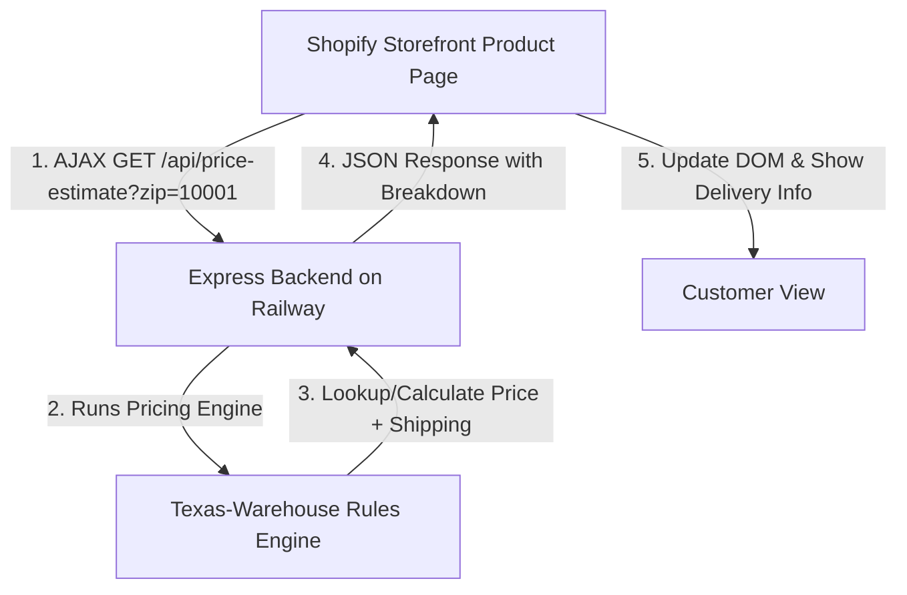

# Implementation Plan: Shopify ZIP Code-Based Product Pricing Demo

This plan outlines the architecture and steps to implement a premium ZIP-code-based product pricing widget, tailored for [Sofabed](https://www.sofabed.com/) (shipping heavy furniture from a Texas warehouse).

## 1. System Architecture

## 2. Technical Stack

*   **Backend**: Node.js with **Express.js** (lightweight, high performance, natively supported on Railway).
*   **Logistics Engine**: Custom routing rules calculating shipping distances from a central Texas warehouse (ZIP `75201` - Dallas, TX).
*   **Storefront Integration**: Production-ready **Custom Liquid + Vanilla JavaScript** snippet designed to blend seamlessly into Shopify’s customizer.
*   **Deployment**: Hosted on **Railway** with a public API endpoint.

---

## 3. Detailed Components

### A. The Backend API (`/api/price-estimate`)
The Express backend will accept:
*   `zip`: Customer destination ZIP code (5 digits).
*   `base_price`: Base product price in cents (retrieved dynamically from Liquid).
*   `product_id` / `variant_id`: IDs for tracking.

It will process the calculation through a dual-mode engine:
1.  **Exact Matching** (for demo requirements):
    *   `75028` (Flower Mound, TX) $\rightarrow$ Total: **$1,499** (e.g. $1,399 base + $100 shipping)
    *   `10001` (New York, NY) $\rightarrow$ Total: **$1,699** (e.g. $1,399 base + $300 shipping)
    *   `90210` (Beverly Hills, CA) $\rightarrow$ Total: **$1,799** (e.g. $1,399 base + $400 shipping)
2.  **Dynamic Routing Zones** (for any other US ZIP code based on regional prefixes):
    *   **Zone 1 (South Central / TX - prefix 7)**: Shipping $99 | Delivery 1-3 Days
    *   **Zone 2 (Midwest/Southeast - prefixes 3, 4, 5, 6)**: Shipping $149 | Delivery 3-5 Days
    *   **Zone 3 (East Coast - prefixes 0, 1, 2)**: Shipping $199 | Delivery 4-6 Days
    *   **Zone 4 (West Coast / Mountain - prefixes 8, 9)**: Shipping $299 | Delivery 5-8 Days

### B. Storefront Widget (Sofabed Style)
To make this look like a premium feature on [Sofabed.com](https://www.sofabed.com/), the widget will match their design language:
*   **Fonts**: Jost (sans-serif) & Bodoni Moda (headings).
*   **Colors**: Sleek charcoal text, amber/gold accent buttons (`#f9aa00`), and clean borders.
*   **UX Features**:
    *   Clean inputs with ZIP code validation.
    *   Interactive loading state (with a subtle spinner).
    *   Detailed pricing breakdown showing *Base Price*, *Local Shipping & Handling*, and the *Total Price*.
    *   Dynamic delivery time estimates ("Arrives in 1-3 business days from our TX warehouse").
    *   Persistent storage (`localStorage`) so the customer doesn't have to re-enter their ZIP code when browsing other products.

---

## 4. Step-by-Step Implementation Timeline

| Step | Action Item | Target Files |
| :--- | :--- | :--- |
| **1** | Create Express backend project structure & package configuration | `package.json`, `server.js` |
| **2** | Write the shipping pricing engine (incorporating Texas warehouse logistics) | `pricing.js` |
| **3** | Implement Express server, API routes, and CORS security | `server.js` |
| **4** | Build the Shopify integration widget script | `shopify/zip-pricing-widget.liquid` |
| **5** | Deploy to Railway using a CLI setup | Dockerfile / git setup |
| **6** | Document instructions for the Shopify theme installation | `README.md` |

---

> [!NOTE]
> Since we want to display shipping estimates specifically for furniture, we will design the widget to look premium and highly integrated rather than a basic text box. It will include tooltip details explaining the freight shipping from Texas.
